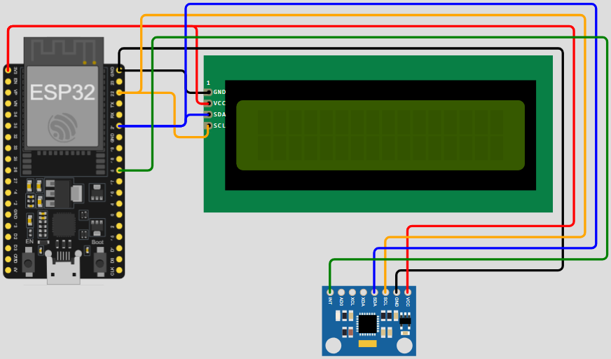

# Motor Condition Monitor (FreeRTOS + ESP32)

A real-time embedded motor monitoring system built on the **ESP32** using **FreeRTOS**. The system collects motion and temperature data from an **MPU6050**, processes the measurements to extract vibration-related metrics, classifies the motor condition using configurable thresholds, and displays the current condition on a **16×2 I2C LCD**.

The system also provides a **UART-based serial interface** for viewing recent measurements, statistics, and threshold settings.

## 🚀 Features

- **FreeRTOS Multi-Tasking:** Separates sensor acquisition, motor-condition assessment, and user-interface handling into independent FreeRTOS tasks.
- **MPU6050 Integration:** Collects 3-axis accelerometer, 3-axis gyroscope, and temperature measurements over I2C.
- **Interrupt-Driven Sampling:** The MPU6050 data-ready interrupt notifies the sensor task when a new sample is available.
- **Vibration Analysis:** Processes 256-sample windows to calculate:
  - Acceleration RMS
  - Gyroscope RMS
  - Acceleration peak
  - Crest factor
  - Dominant vibration frequency using FFT
  - Motor temperature
- **Motor Condition Classification:** Classifies the motor into `NORMAL`, `WARNING`, `ALARM`, `FAULT_PENDING`, or `FAULT` states based on configurable acceleration RMS, crest-factor, and temperature thresholds.
- **Fault Persistence Detection:** A fault condition must persist for five consecutive measurements before entering the `FAULT` state.
- **I2C LCD Display:** Displays the current motor condition on a 16×2 LCD using an I2C PCF8574 interface.
- **UART User Interface:** Provides a serial menu for viewing recent measurements, statistics, and threshold settings.
- **Configurable Thresholds:** Warning, alarm, and fault thresholds can be viewed and modified through the serial interface.
- **ESP-DSP Integration:** Uses the Espressif `esp-dsp` component for FFT and signal-processing operations.

## 📂 Project Structure

```text
├── components/
│   ├── io_devices/
│   │   ├── Datasheets/
│   │   │   ├── lcd_i2c/       # LCD/PCF8574 datasheets and pin mapping
│   │   │   └── mpu6050/       # MPU6050 datasheets and register map
│   │   ├── ext_serial.c/h     # UART interface
│   │   ├── lcd_i2c.c/h        # I2C LCD driver
│   │   └── mpu6050.c/h        # MPU6050 driver
│   │
│   └── tasks/
│       ├── ReadMotor.c/h          # MPU6050 acquisition and signal processing
│       ├── AssessMotorState.c/h   # Motor-condition classification and logging
│       └── UIManager.c/h          # UART-based user interface
│
├── images/
│   ├── ESP32-DevKitC V4.png
│   └── Motor_Condition_Monitor.PNG
│
├── main/
│   ├── main.c                # Application initialization and task creation
│   ├── CMakeLists.txt
│   ├── idf_component.yml     # ESP-DSP dependency
│   └── Kconfig.projbuild
│
├── CMakeLists.txt
└── LICENSE
```

## 🛠️ Hardware Requirements

1. ESP32 development board
2. MPU6050 accelerometer/gyroscope
3. 16×2 HD44780-compatible LCD
4. PCF8574 I2C LCD adapter
5. Motor or mechanical test setup
6. UART/serial connection

The project monitors the motor through the MPU6050 that's bolted to the motor housing.

## 🔌 Hardware Wiring

The MPU6050 and LCD share the ESP32's I2C bus.

### I2C Connections

| Signal | ESP32 GPIO |
| :--- | :---: |
| SDA | GPIO 21 |
| SCL | GPIO 22 |

### MPU6050

| Signal | Configuration |
| :--- | :--- |
| I2C Address | `0x68` |
| Data-ready interrupt | GPIO 5 |
| Accelerometer range | ±4 g |
| Gyroscope range | ±250 °/s |
| Sample rate | 200 Hz |

### I2C LCD

| Parameter | Configuration |
| :--- | :--- |
| I2C Address | `0x27` |
| Display | 16×2 |
| I2C Clock | 100 kHz |

### UART Interface

The serial interface is configured as:

| Parameter | Configuration |
| :--- | :--- |
| UART | UART2 |
| TX | GPIO 17 |
| RX | GPIO 16 |
| Baud rate | 115200 |
| Data format | 8-N-1 |

The wiring schematic is shown below.



## 📊 Signal Processing

The `ReadMotor` task waits for a data-ready notification from the MPU6050 interrupt. Each sensor sample contains:

- 3-axis acceleration
- 3-axis gyroscope
- Temperature

The firmware calculates the magnitude of the acceleration and gyroscope vectors. Earth's gravitational acceleration is removed from the acceleration magnitude before vibration analysis.

The system collects **256 acceleration samples at 200 Hz**, corresponding to approximately **1.28 seconds of data** per processing window.

For each window, the following metrics are calculated:

| Metric | Description |
| :--- | :--- |
| Acceleration RMS | Overall vibration magnitude |
| Gyroscope RMS | Overall rotational motion magnitude |
| Acceleration Peak | Maximum measured vibration magnitude |
| Crest Factor | Ratio of peak acceleration to RMS acceleration |
| Dominant Frequency | Frequency corresponding to the largest FFT magnitude |
| Temperature | MPU6050 temperature measurement |

The FFT is implemented using the **Espressif ESP-DSP** library with a Hann window.

## 🧠 Motor Condition Classification

The `AssessMotorState` task evaluates each processed measurement window.

The classification thresholds are based on three metrics:

- Acceleration RMS
- Crest Factor
- Temperature

A state is entered when **any** of these metrics reaches its corresponding entry threshold. A state is exited only when **all three metrics** fall below their corresponding exit thresholds.

### Motor States

```text
                         ┌─────────────────┐
                         │     UNKNOWN     │
                         └────────┬────────┘
                                  │
                           get_motor_state()
                                  │
                                  ▼
                 ┌────────────────────────────────┐
                 │                                │
                 │     NORMAL / WARNING / ALARM   │
                 │                                │
                 └────────────────────────────────┘
                    ▲          ▲           ▲
                    │          │           │
                    │          │           │
                    │          │           │
                    │          │           │
        ┌───────────┘          │           └──────────┐
        │                      │                      │
        │                      │                      │
        │                      │                      │
        │    warning_en/ex()   │      alarm_en/ex()   │
  ┌─────┴─────┐          ┌─────┴─────┐          ┌─────┴─────┐
  │  NORMAL   │◄────────►│  WARNING  │◄────────►│   ALARM   │
  └─────┬─────┘          └─────┬─────┘          └─────┬─────┘
        │                      │                      │
        │                      │                      │
        │ fault_enter()        │ fault_enter()        │ fault_enter()
        │                      │                      │
        └──────────────────────┼──────────────────────┘
                               ▼
                     ┌─────────────────┐
                     │ FAULT PENDING   │
                     └────────┬────────┘
                              │
                 ┌────────────┴────────────┐
                 │                         │
           fault clears            fault persists
                 │                 for 5 consecutive
                 │                    measurements
                 ▼                         │
        NORMAL / WARNING /                 ▼
             ALARM                ┌─────────────────┐
                                  │      FAULT      │
                                  └────────┬────────┘
                                           │
                                      fault_exit()
                                           │
                                           ▼
                                  NORMAL / WARNING /
                                       ALARM
```

The `FAULT_PENDING` state prevents a single abnormal measurement from immediately causing a fault. The fault condition must be detected for **five consecutive measurements** before the system enters `FAULT`.

### Default Thresholds

#### Acceleration RMS

| State | Enter | Exit |
| :--- | ---: | ---: |
| Warning | 0.50 g | 0.40 g |
| Alarm | 1.20 g | 1.00 g |
| Fault | 1.80 g | 1.60 g |

#### Crest Factor

| State | Enter | Exit |
| :--- | ---: | ---: |
| Warning | 3.5 | 3.0 |
| Alarm | 5.0 | 4.5 |
| Fault | 7.0 | 6.0 |

#### Temperature

| State | Enter | Exit |
| :--- | ---: | ---: |
| Warning | 55 °C | 50 °C |
| Alarm | 70 °C | 65 °C |
| Fault | 82 °C | 77 °C |

These values are configurable at runtime through the serial interface.

## 🖥️ User Interface

The project provides two forms of output:

### I2C LCD

The LCD displays the current motor condition whenever the motor state changes.

Examples include:

```text
Motor Condition
NORMAL OPERATION
```

```text
Motor Condition
MOTOR WARNING
```

```text
Motor Condition
CHECKING FAULT..
```

```text
Motor Condition
MOTOR FAULTED
```

### UART Serial Menu

The UART interface provides a command-line menu for interacting with the system:

```text
=================================
      MOTOR UI MANAGER MENU
=================================
1. Show Last 10 Measurements
2. View Statistics
3. Reset Statistics
4. View Threshold Settings
5. Change Threshold Settings
=================================
Select an option:
```

The measurement history contains the most recent **10 processed measurements**.

Available statistics include:

- Average acceleration RMS
- Average crest factor
- Average temperature
- Minimum acceleration peak
- Maximum acceleration peak
- Number of processed samples

## 🎚️ FreeRTOS Task Architecture

The firmware is divided into three FreeRTOS tasks.

### `ReadMotor`

Responsible for sensor acquisition and signal processing.

- Waits for MPU6050 data-ready notifications
- Reads sensor data over I2C
- Calculates acceleration and gyroscope magnitudes
- Accumulates 256-sample measurement windows
- Calculates RMS and peak values
- Calculates crest factor
- Performs FFT-based dominant-frequency analysis
- Sends processed measurements through a FreeRTOS queue

**Priority: 5**

### `AssessMotorState`

Responsible for motor-condition assessment and data logging.

- Receives processed measurements from `ReadMotor`
- Evaluates warning, alarm, and fault thresholds
- Performs motor-state transitions
- Implements fault persistence detection
- Updates the I2C LCD when the state changes
- Maintains the recent measurement history
- Calculates statistics
- Responds to measurement/statistics requests from the UART interface

**Priority: 4**

### `UIManager`

Responsible for the UART-based user interface.

- Displays the serial menu
- Reads user commands from UART
- Requests measurement history
- Requests statistics
- Resets statistics
- Displays threshold values
- Allows threshold values to be modified

**Priority: 3**

## 🔄 Task Communication

The tasks use several FreeRTOS synchronization mechanisms:

```text
                    MPU6050
                       │
                Data-Ready Interrupt
                       │
                       ▼
              ┌─────────────────┐
              │   ReadMotor     │
              │   Priority 5    │
              └────────┬────────┘
                       │
                 FreeRTOS Queue
                       │
                       ▼
              ┌─────────────────┐
              │ AssessMotorState│
              │   Priority 4    │
              └───────┬─────┬───┘
                      │     │
                      │     └──────────► LCD
                      │
                      ▼
                Measurements /
                  Statistics
                      ▲
                      │
              Event Groups
                      │
              ┌───────┴────────┐
              │   UIManager    │
              │   Priority 3   │
              └───────┬────────┘
                      │
                      ▼
                     UART
```

An I2C mutex protects access to the shared I2C bus between the MPU6050 and LCD.

## ⚙️ Building the Project

This project uses the **ESP-IDF CMake build system** and depends on Espressif's `esp-dsp` component.

After configuring the ESP-IDF environment, the project can be built using the standard ESP-IDF workflow:

```bash
idf.py set-target esp32
idf.py build
idf.py flash
idf.py monitor
```

The `esp-dsp` dependency is declared in:

```text
main/idf_component.yml
```

## 📚 Included Documentation

The repository includes datasheets and reference documentation for:

- MPU6050
- HD44780 LCD
- PCF8574 I2C adapter

Additional ESP32 and system wiring diagrams are available in the `images/` directory.

## 📄 License

This project is released into the **Public Domain (CC0)**. See [`LICENSE`](LICENSE) for details.
